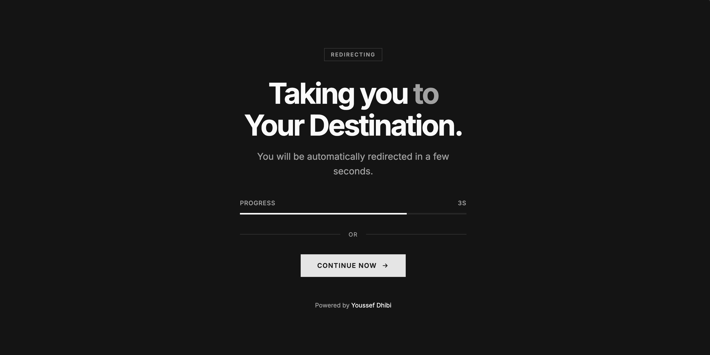

# Redirect Page Template

A minimal, elegant redirect page with smooth animations and automatic light/dark mode support.



## Features

- Modern, clean design with smooth animations
- Automatic dark mode based on system preference
- Countdown timer with visual progress bar
- Fully responsive on all devices
- Zero dependencies, pure HTML, CSS, and JavaScript
- Lightweight, single file under 10KB

## Quick Start

1. Download the `index.html` file
2. Open the file and update the configuration:

```javascript
const REDIRECT_URL = 'https://your-destination.com';  // Your destination URL
const DURATION = 4000;                                 // Countdown in milliseconds
```

3. Customize the heading and text content in the HTML
4. Deploy to your hosting provider

## Configuration

### JavaScript Settings

| Variable | Description | Default |
|----------|-------------|---------|
| `REDIRECT_URL` | The URL to redirect to | `https://youssef.tn` |
| `DURATION` | Countdown duration in milliseconds | `10000` (10 seconds) |

### Customizable Elements

- **Title**: Update the `<title>` tag in the `<head>`
- **Heading**: Modify the `<h1>` content
- **Subtitle**: Change the `.subtitle` paragraph
- **Button Text**: Edit the text inside `.continue-btn`
- **Button Link**: Update the `href` on the continue button

## Theming

The template uses CSS custom properties for easy theming. Colors are defined using the OKLCH color space:

```css
:root {
    --background: oklch(1 0 0);
    --foreground: oklch(0.145 0 0);
    --muted: oklch(0.97 0 0);
    --muted-foreground: oklch(0.556 0 0);
    --border: oklch(0.922 0 0);
    --primary: oklch(0.205 0 0);
    --primary-foreground: oklch(0.985 0 0);
}
```

Dark mode colors are automatically applied via `@media (prefers-color-scheme: dark)`.

## Browser Support

- Chrome (latest)
- Firefox (latest)
- Safari (latest)
- Edge (latest)
- Opera (latest)

## License

MIT License. See the [LICENSE](LICENSE) file for details.

## Author

Youssef Dhibi

- Website: [youssef.tn](https://youssef.tn)
- GitHub: [@youssefsz](https://github.com/youssefsz)
